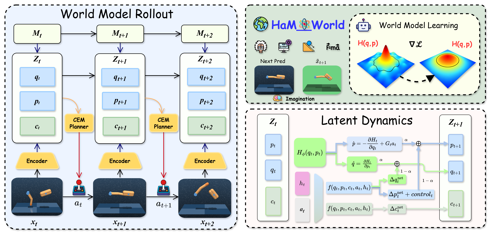

<div align="center">

# [NeurIPS 2026] HaM-World

### Soft-Hamiltonian World Models with Selective Memory for Planning

Haoyun Tang<sup>*</sup>, Haodong Cui<sup>*</sup>, Keyao Xu, Kun Wang<sup>†</sup>, Zhandong Mei<sup>†</sup>

[](https://arxiv.org/abs/2605.05951)
[](https://arxiv.org/abs/2605.05951)
[](https://arxiv.org/pdf/2605.05951)
[](https://github.com/HaoyunT/HaM_World/stargazers)

<sup>*</sup> Equal contribution. <sup>†</sup> Corresponding authors.

</div>

<div align="center">

</div>

## News

- **Sep. 2026:** 🎉 HaM-World has been accepted by **NeurIPS 2026**.
- **May 2026:** HaM-World is available on [arXiv](https://arxiv.org/abs/2605.05951), with the research code released.

## About

Official GitHub repository for the NeurIPS 2026 paper **HaM-World: Soft-Hamiltonian World Models with Selective Memory for Planning**.

## Overview

HaM-World is a world-model framework for long-horizon planning. It combines a
soft-Hamiltonian latent dynamics model with a selective memory mechanism so that
the planner can preserve useful history while maintaining a structured latent
state for imagined rollouts.

The latent state is decomposed into a Hamiltonian state and a semantic context:

- the Hamiltonian state models structured position/momentum-like dynamics;
- the semantic context carries task-relevant information that is not captured by
  the physical state alone;
- selective memory summarizes long histories and filters irrelevant observations;
- energy, residual/control dynamics, and value estimation are exposed through a
  planner-facing latent interface.

The repository contains the canonical implementation, baseline agents, paper
result exports, mechanism-analysis traces, and scripts used to rebuild the
paper-facing figures and tables.

## Repository Contents

The maintained comparison includes:

- `HaM-World`
- `DreamerV3`
- `TD-MPC2`
- `PPO`
- `SAC`

The repository keeps full raw runs for the main comparison and compact,
paper-facing exports for OOD, ablation, and mechanism analyses. Exploratory
sweeps and failed reruns are intentionally excluded.

## Results

Paper-facing results are available directly in the repository:

- [Main comparison table](results/main/tables/paper_main_results.csv)
- [Main learning curves](results/main/figures/main_results_curves_assembled.png)
- [Long-horizon table](results/main/tables/long_horizon_k357.csv)
- [OOD retention table](results/ood/tables/ood_condition_retention.csv)
- [Ablation table](results/ablation/tables/paper_ablation_core_table.csv)
- [Mechanism figures](results/mechanism/figures/)
- [Rollout overview](results/main/figures/rollout_overview_4tasks.png)

## Installation

The reference environment uses Python 3.11. `uv` is recommended for a local
editable environment:

```bash
uv venv .venv
source .venv/bin/activate
uv pip install -r requirements.txt
```

The Conda environment is also provided:

```bash
conda env create -f environment.yml
conda activate ham_world
```

The main dependencies are PyTorch 2.2 or newer, Gymnasium with MuJoCo,
`dm-control`, NumPy, PyYAML, tqdm, and Matplotlib. GPU execution is recommended
for training and long-horizon evaluation.

## Quick Start

List supported algorithms, presets, and configurations:

```bash
python launch.py list
```

Dry-run a HaM-World training plan:

```bash
python launch.py train \
  --algo hamworld \
  --preset compare_dmcontrol \
  --seed 7 \
  --output-root outputs \
  --dry-run
```

Train HaM-World on the Finger and Reacher preset:

```bash
python launch.py train \
  --algo hamworld \
  --preset finger_reacher \
  --seed 7 \
  --output-root outputs
```

Run all five maintained algorithms for one comparison preset:

```bash
python launch.py train \
  --algo all \
  --preset compare_dmcontrol \
  --seed 7 \
  --output-root outputs
```

The shell entrypoints under `scripts/train/` provide equivalent paper-run
commands. Set `PYTHON_BIN` when the environment uses a non-default Python
executable.

## Rebuild Paper Assets

Rebuild the main and analysis summaries with:

```bash
python scripts/rebuild_main_return_table.py
python scripts/rebuild_long_horizon_table.py
python scripts/replot_main_curves.py
python scripts/rebuild_ablation_core_table.py
python scripts/rebuild_ood_summaries.py
python scripts/rebuild_rollout_overview.py
```

For mechanism figures:

```bash
python scripts/replot_h_freerun.py
python scripts/replot_phase_portrait.py
python scripts/replot_pqc.py
```

Paths in result manifests are repository-relative, so the repository can be
moved without manually rewriting experiment roots.

## Repository Layout

```text
HaM_World/
├── launch.py
├── environment.yml
├── requirements.txt
├── hamworld/                  # canonical HaM-World implementation
├── baselines/                 # DreamerV3 / TD-MPC2 / PPO / SAC
├── runs/main/                 # raw runs for the main comparison
├── results/
│   ├── main/                  # main curves, tables, and manifests
│   ├── ood/                   # compact OOD exports
│   ├── ablation/              # compact ablation exports
│   ├── mechanism/             # mechanism figures and trace bundles
│   └── appendix/              # appendix-only assets
├── assets/                    # architecture figures
└── scripts/                   # training, rebuild, and plotting utilities
```

`launch.py` is a convenience wrapper around the individual training modules.
It selects algorithms and presets, applies seeds and output roots, expands
multi-task configurations, and optionally resumes from checkpoints.

## Citation

If you use HaM-World in your research, please cite:

```bibtex
@inproceedings{tang2026hamworld,
  title={HaM-World: Soft-Hamiltonian World Models with Selective Memory for Planning},
  author={Tang, Haoyun and Cui, Haodong and Xu, Keyao and Wang, Kun and Mei, Zhandong},
  booktitle={Advances in Neural Information Processing Systems},
  year={2026}
}
```

## Acknowledgements

This repository includes implementations and comparison code for the baselines
listed above. Please consult the corresponding source files and configuration
headers for upstream attribution and usage requirements before redistribution.
